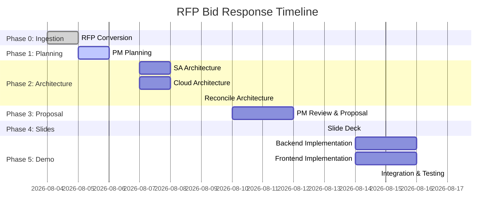
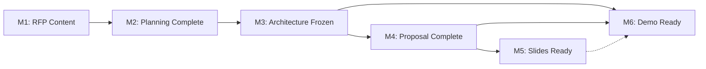

# Project Plan — RFP Bid Response

> **Status:** DRAFT — pending RFP content  
> **Owner:** PM (FPT Software)  
> **Date:** 2026-08-05

---

## 1. Project Overview

### 1.1 Background
FPT Software is responding to an RFP (Request for Proposal) from a Japanese client. This project produces:
- **Detailed design documentation** demonstrating FPT Software's analysis & design capabilities
- **A functional demo / quick win** to prove execution capability and create a wow effect

### 1.2 Objectives
| # | Objective | Success Criteria |
|---|-----------|-----------------|
| A | Detailed Design Documentation | Complete proposal document covering all RFP requirements in Japanese |
| B | Demo / Quick Win | Working frontend + backend demo that client can interact with |
| C | Language | All documents and demo UI in **Japanese** |

### 1.3 Scope
**In scope:**
- RFP analysis and response documentation
- System architecture design (application + cloud/infrastructure)
- Proposal document in Japanese
- Presentation slide deck
- Functional demo (backend API + frontend UI)

**Out of scope:**
- Full production implementation
- Non-Japanese language support

---

## 2. Work Breakdown Structure

### 2.1 Phase 0: Document Ingestion ✅
#### 2.1.1 Convert RFP PDF → Markdown — Est: 1 day — Owner: PDF Converter
- **Status:** BLOCKED — no RFP document provided

### 2.2 Phase 1: Planning (Current)
#### 2.2.1 Read RFP content and converter handoff — Est: 0.5 day — Owner: PM
#### 2.2.2 Create project plan and WBS — Est: 0.5 day — Owner: PM
#### 2.2.3 Create working protocol and RACI — Est: 0.5 day — Owner: PM
#### 2.2.4 Create output templates and naming conventions — Est: 0.5 day — Owner: PM
#### 2.2.5 Create risk register — Est: 0.5 day — Owner: PM
#### 2.2.6 Write handoff to SA/Cloud Expert — Est: 0.5 day — Owner: PM

### 2.3 Phase 2: Architecture Design (PARALLEL)
#### 2.3.1 System architecture design — Est: 2 days — Owner: Solutions Architect
- High-level architecture diagram
- Component design
- Data model / ERD
- **API contract** (OpenAPI/Swagger spec)

#### 2.3.2 Cloud & infrastructure design — Est: 2 days — Owner: Cloud Expert
- Cloud architecture diagram
- Security design
- Scaling strategy
- Cost estimation

#### 2.3.3 Reconcile SA and Cloud outputs — Est: 0.5 day — Owner: Coordinator

### 2.4 Phase 3: PM Review & Proposal
#### 2.4.1 Review & consolidate all docs — Est: 1 day — Owner: PM
#### 2.4.2 Update plan/architecture if gaps found — Est: 0.5 day — Owner: PM
#### 2.4.3 Write detailed Proposal in Japanese — Est: 2 days — Owner: PM
#### 2.4.4 Define demo scope & scenario — Est: 0.5 day — Owner: PM
#### 2.4.5 List data to prepare for demo — Est: 0.5 day — Owner: PM

### 2.5 Phase 4: Slide Deck
#### 2.5.1 Create presentation slides from proposal — Est: 1 day — Owner: Slide Craft

### 2.6 Phase 5: Demo Implementation (PARALLEL)
#### 2.6.1 Backend demo implementation — Est: 3 days — Owner: Backend Engineer
- Implement API endpoints per frozen API contract
- Database setup and sample data

#### 2.6.2 Frontend demo implementation — Est: 3 days — Owner: Frontend Engineer
- Implement UI per demo scope
- Japanese localization

#### 2.6.3 Integration & testing — Est: 1 day — Owner: Coordinator

---

## 3. Project Timeline



### 3.1 Milestones

| ID | Milestone | Target Date | Exit Criteria |
|----|-----------|-------------|---------------|
| M1 | RFP Content Available | 2026-08-05 | All RFP docs converted to Markdown |
| M2 | Planning Complete | 2026-08-06 | Project plan, protocol, templates approved |
| M3 | Architecture Frozen | 2026-08-09 | SA + Cloud docs complete, API contract locked |
| M4 | Proposal Complete | 2026-08-12 | Proposal in Japanese, demo scope defined |
| M5 | Slides Ready | 2026-08-13 | Slide deck reviewed and approved |
| M6 | Demo Ready | 2026-08-17 | Backend + Frontend integrated and tested |

---

## 4. RACI Matrix

| Activity | PM | Solutions Architect | Cloud Expert | Backend Eng | Frontend Eng | Slide Craft |
|----------|:--:|:-------------------:|:------------:|:-----------:|:------------:|:-----------:|
| RFP Analysis | A | C | C | I | I | I |
| Project Planning | R | I | I | I | I | I |
| System Architecture | C | R | C | I | I | I |
| Cloud Architecture | C | C | R | I | I | I |
| API Contract Design | A | R | C | C | I | I |
| Proposal Writing | R | C | C | I | I | I |
| Demo Scope Definition | R | C | C | C | C | I |
| Slide Deck Creation | C | C | C | I | I | R |
| Backend Demo | I | C | C | R | I | I |
| Frontend Demo | I | C | C | C | R | I |
| Integration & Testing | A | I | I | C | C | I |

*R=Responsible, A=Accountable, C=Consulted, I=Informed*

---

## 5. Risk Register

| ID | Risk | Probability | Impact | Score | Mitigation | Owner | Status |
|----|------|-------------|--------|-------|------------|-------|--------|
| R1 | RFP content not available or incomplete | **High** | **High** | **H** | Unblock PDF Converter step immediately; flag missing sections in proposal | PM | **OPEN — ACTIVE** |
| R2 | Architecture conflicts between SA and Cloud Expert | Medium | Medium | M | Early coordination meeting; coordinator reconciles | Coordinator | Open |
| R3 | API contract changes after demo implementation starts | Medium | High | H | Freeze API contract before Step 5; change control process | PM | Open |
| R4 | Japanese translation quality issues | Medium | High | H | Use native Japanese phrasing; review by Japanese speaker | PM | Open |
| R5 | Demo scope too ambitious for timeline | Medium | Medium | M | Prioritize wow moments; MVP-first approach | PM | Open |
| R6 | Parallel workstreams produce incompatible outputs | Medium | Medium | M | Shared API contract as single source of truth | Coordinator | Open |

---

## 6. Communication Plan

| Communication | Audience | Frequency | Format | Owner |
|--------------|----------|-----------|--------|-------|
| Step handoff notes | Next role in pipeline | Per step | Markdown | Each role |
| Status updates | PM / Orchestrator | Per step | Todo tool + handoff | Each role |
| Architecture review | PM, SA, Cloud Expert | After Step 2 | Document review | Coordinator |
| Proposal review | PM | After Step 3 | Document review | PM |
| Demo readiness check | All | Before Step 5 completion | Integration test | Coordinator |

---

## 7. Naming Conventions

### 7.1 Document Naming
```
docs/NN_foldername/filename.md
```
- `NN` = two-digit step number (00, 01, 02, ...)
- `foldername` = lowercase, snake_case
- `filename` = descriptive, lowercase, snake_case

### 7.2 Example Files
| File | Purpose |
|------|---------|
| `docs/00_converted/rfp_content.md` | Converted RFP content |
| `docs/01_planning/project_plan.md` | This document |
| `docs/01_planning/working_protocol.md` | Working protocol |
| `docs/02_system_architecture/architecture.md` | System architecture |
| `docs/02_system_architecture/api_contract.md` | API contract (OpenAPI) |
| `docs/03_cloud_infrastructure/infrastructure.md` | Cloud architecture |
| `docs/04_pm_final/proposal.md` | Final proposal (Japanese) |
| `docs/04_pm_final/demo_scope.md` | Demo scope & scenario |
| `slides/presentation.html` | Slide deck (HTML) |
| `slides/presentation.pdf` | Slide deck (PDF) |

---

## 8. Output Templates

### 8.1 Architecture Document Template
```markdown
# System Architecture

## 1. Overview
## 2. Architecture Diagram (Mermaid)
## 3. Component Description
## 4. Data Model (ERD - Mermaid)
## 5. API Contract (OpenAPI spec)
## 6. Technology Stack
## 7. Non-functional Requirements
## 8. Assumptions & Constraints
```

### 8.2 Cloud Infrastructure Template
```markdown
# Cloud Infrastructure Design

## 1. Overview
## 2. Architecture Diagram (Mermaid)
## 3. Service Selection & Justification
## 4. Security Design
## 5. Scaling Strategy
## 6. Cost Estimation
## 7. Disaster Recovery
## 8. Monitoring & Observability
```

### 8.3 Proposal Template (Japanese)
```markdown
# 提案書

## 1. 概要 (Executive Summary)
## 2. 要件理解 (Requirements Understanding)
## 3. 提案内容 (Proposal Content)
## 4. システム構成 (System Architecture)
## 5. 開発アプローチ (Development Approach)
## 6. プロジェクト計画 (Project Plan)
## 7. チーム構成 (Team Structure)
## 8. 品質保証 (Quality Assurance)
## 9. 見積もり (Cost Estimate)
## 10. なぜ FPT ソフトウェアか (Why FPT Software)
```

### 8.4 Demo Scope Template
```markdown
# Demo Scope & Scenario

## 1. Demo Objectives
## 2. Target Audience
## 3. User Journey / Flow
## 4. Screen-by-Screen Walkthrough
## 5. Wow Moments
## 6. Data Requirements
## 7. Setup Instructions
## 8. Known Limitations
```

---

## 9. Critical Path



**Critical path:** M1 → M2 → M3 → M4 → M6 (Demo Ready)

The demo (M6) is on the critical path and depends on both architecture (M3) and proposal (M4). Any delay in architecture directly delays the demo.

---

## 10. Contingency

- **Buffer:** 15% time contingency built into each phase
- **RFP Content Risk (R1):** If RFP content is significantly delayed, parallel work on templates and structure can proceed; content-specific sections will be completed once available
- **Architecture Risk (R2):** If SA and Cloud Expert produce conflicting designs, reserve 0.5 day for reconciliation before proceeding

---

*End of Project Plan*